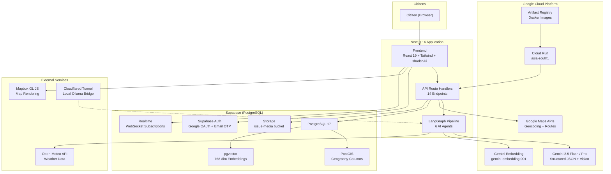
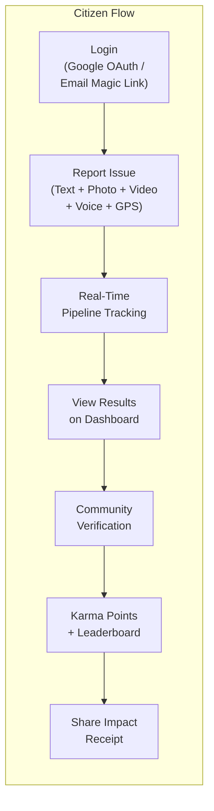
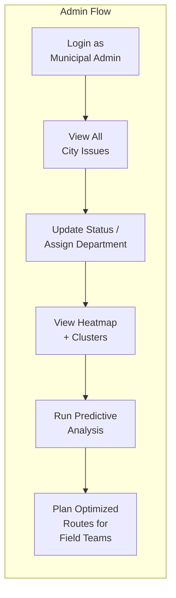
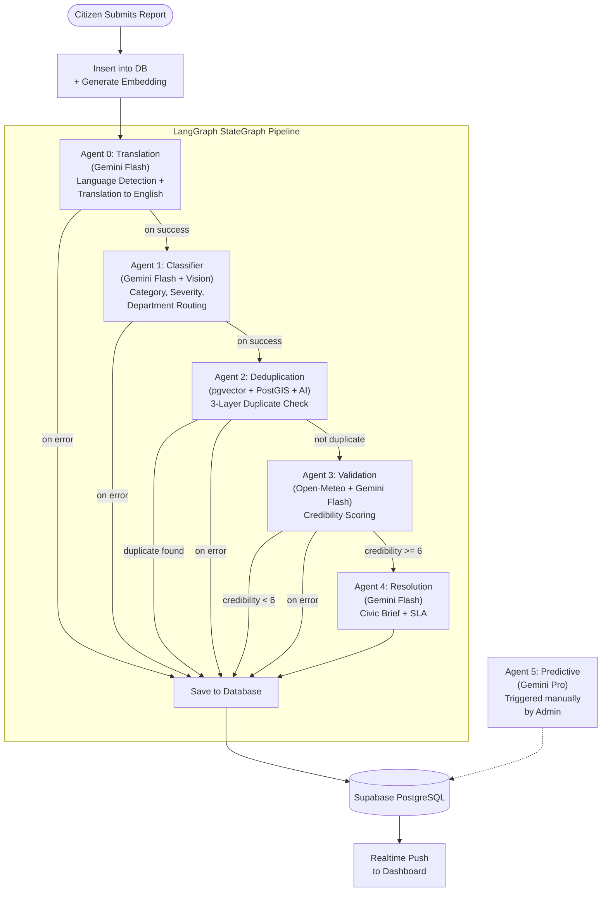
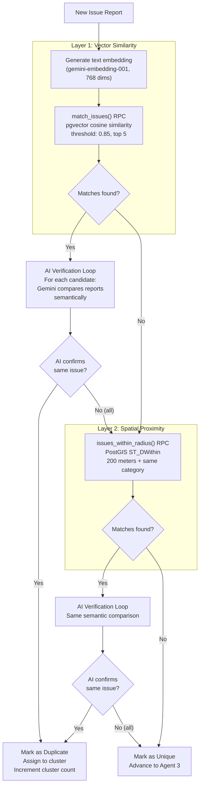
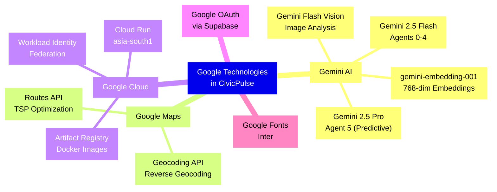
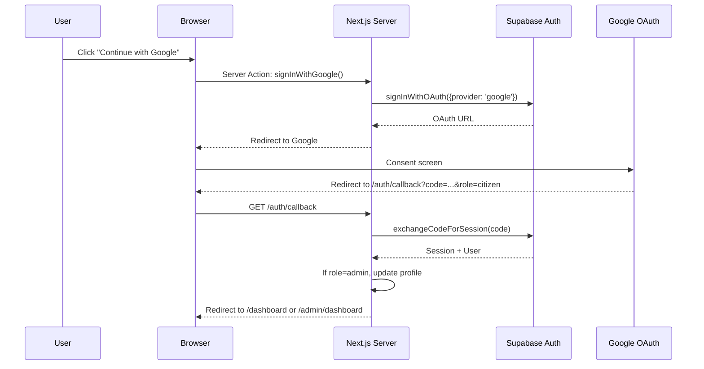
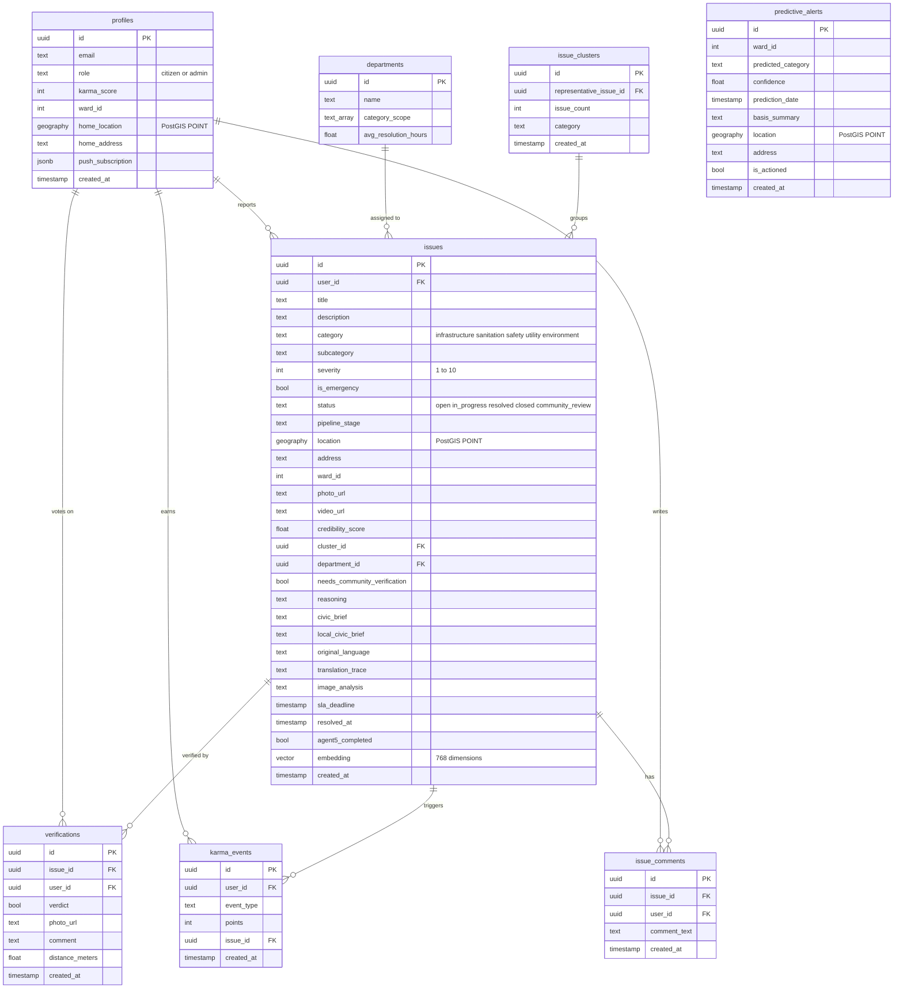
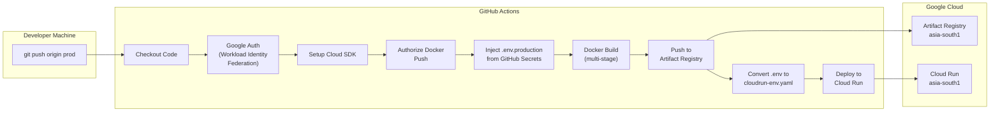
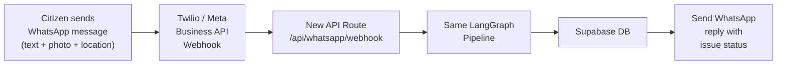

# CivicPulse -- Technical Documentation

**Problem Statement 2: Community Hero -- Hyperlocal Problem Solver**

| | |
|---|---|
| **Submitted by** | Ronit Sonawane |
| **Affiliation** | B.Tech 1st Year, Computer Science and Engineering, IIT Guwahati |
| **Team Size** | Solo (Individual Submission) |
| **Repository** | [github.com/ronits2407/civicpulse](https://github.com/ronits2407/civicpulse) |
| **Deployment** | Google Cloud Run (asia-south1) |
| **Date** | June 2026 |

---

## Table of Contents

1. [Problem Statement and Motivation](#1-problem-statement-and-motivation)
2. [Solution Overview](#2-solution-overview)
3. [System Architecture](#3-system-architecture)
4. [Agentic AI Pipeline -- Deep Dive](#4-agentic-ai-pipeline----deep-dive)
5. [Google Technologies Used](#5-google-technologies-used)
6. [Innovation and Creativity](#6-innovation-and-creativity)
7. [Product Experience and Design](#7-product-experience-and-design)
8. [User Perspective -- Accessibility and Inclusivity](#8-user-perspective----accessibility-and-inclusivity)
9. [Technical Implementation](#9-technical-implementation)
10. [Database Schema Reference](#10-database-schema-reference)
11. [DevOps, CI/CD, and Cloud Deployment](#11-devops-cicd-and-cloud-deployment)
12. [Completeness and Usability](#12-completeness-and-usability)
13. [What Makes CivicPulse Different](#13-what-makes-civicpulse-different)
14. [Future Implementation Roadmap](#14-future-implementation-roadmap)
15. [File-by-File Reference](#15-file-by-file-reference)
16. [Environment Variables Reference](#16-environment-variables-reference)

---

## 1. Problem Statement and Motivation

### 1.1 The Challenge (as stated by the Jury)

> Communities frequently face issues such as potholes, water leakages, damaged streetlights, waste management concerns, and public infrastructure challenges. Reporting these issues is often fragmented, difficult to track, and lacks transparency.
>
> **Build a platform that enables citizens to identify, report, validate, track, and resolve community issues through collaboration, data, and intelligent automation.** The solution should encourage transparency, accountability, and community participation.

### 1.2 Why This Matters

India has over 4,000 urban local bodies serving 500 million urban citizens. The existing civic grievance redressal systems suffer from the following systemic failures:

- **Fragmented reporting**: Citizens must navigate different municipal portals, phone lines, or physical offices for different types of complaints. There is no single unified platform.
- **No intelligent triage**: Every report is treated equally. A life-threatening open manhole and a faded road marking enter the same queue with the same priority.
- **Duplicate flooding**: The same pothole is reported 50 times by 50 different citizens. Each becomes a separate ticket. Municipal bandwidth is wasted processing duplicates instead of fixing the problem.
- **Zero accountability**: Once a report is filed, the citizen has no visibility into whether it was acknowledged, assigned, or resolved. SLA tracking is non-existent.
- **Language barriers**: India has 22 scheduled languages. A platform that only works in English excludes the majority of citizens who think and speak in Hindi, Marathi, Tamil, Bengali, and other regional languages.
- **No predictive capability**: Municipal corporations are always reactive. They fix potholes after accidents happen, clear drains after flooding occurs. There is no mechanism to anticipate and prevent.

### 1.3 How CivicPulse Addresses Every Aspect

| Problem | CivicPulse Solution |
|---|---|
| Fragmented reporting | Single platform: text, photo, video, voice, GPS -- all in one submission |
| No intelligent triage | 6-agent AI pipeline: classifies, deduplicates, validates, generates SLA |
| Duplicate flooding | pgvector cosine similarity + PostGIS spatial search + AI semantic verification |
| Zero accountability | Real-time pipeline tracking, SLA deadlines, public issue status |
| Language barriers | Agent 0 detects and translates Hindi, Marathi, Tamil, and other languages |
| No predictive capability | Agent 5: K-means clustering + Gemini Pro for predictive hotspot analysis |
| Lack of engagement | Karma gamification, leaderboard, community verification, Impact Receipts |

---

## 2. Solution Overview

CivicPulse is an AI-powered civic issue reporting and resolution platform built for Indian cities. It accepts citizen reports through multiple modalities (text, image, video, voice), processes them through a six-agent LangGraph pipeline, and provides both citizens and municipal administrators with real-time visibility into every stage of the issue lifecycle.

### 2.1 High-Level Architecture Diagram



### 2.2 Core User Flows





---

## 3. System Architecture

### 3.1 Technology Stack

| Layer | Technology | Version | Purpose |
|---|---|---|---|
| Framework | Next.js (App Router) | 16.2.9 | Full-stack React framework with Turbopack |
| Language | TypeScript | 5.x | Type-safe development with strict mode |
| Runtime | Bun | Latest | Package management and script execution |
| UI Library | shadcn/ui (Radix + Mira) | 4.11.0 | Accessible, composable component primitives |
| Styling | Tailwind CSS | 4.x | Utility-first CSS framework |
| Animation | Framer Motion | 12.41.0 | Page transitions and micro-interactions |
| Maps | Mapbox GL JS | 3.25.0 | Interactive map rendering and GeoJSON layers |
| AI (Primary) | Google Gemini (via @google/genai) | 2.10.0 | Flash/Pro for classification, vision, prediction |
| AI (Alternate) | OpenAI SDK (for Ollama) | 6.45.0 | Self-hosted model support via OpenAI-compatible API |
| Agent Orchestration | LangGraph (@langchain/langgraph) | 1.4.6 | StateGraph with conditional edges |
| Database | Supabase (PostgreSQL 17) | -- | Primary data store with PostGIS + pgvector |
| Auth | Supabase Auth | -- | Google OAuth + Email OTP |
| Storage | Supabase Storage | -- | Image and video uploads |
| Realtime | Supabase Realtime | -- | WebSocket subscriptions for live updates |
| Geocoding | Google Maps Geocoding API | -- | Reverse geocoding (lat/lng to address) |
| Routing | Google Maps Routes API | -- | TSP-optimized route planning |
| Weather | Open-Meteo API | -- | Historical and current weather data |
| Image Processing | sharp | 0.35.2 | Server-side image optimization before AI |
| Clustering | ml-kmeans | 7.0.1 | K-means clustering for predictive analysis |
| Geo Parsing | wkx | 0.5.0 | PostGIS WKB/WKT geometry decoding |
| Deployment | Google Cloud Run | -- | Serverless container hosting |
| CI/CD | GitHub Actions | -- | Automated build and deploy pipeline |
| Container | Docker (multi-stage) | -- | node:20-alpine based production image |

### 3.2 Folder Structure

```
civicpulse/
  app/                              # Next.js App Router (pages and API routes)
    layout.tsx                       # Root layout: Inter font, dark mode, Toaster
    page.tsx                         # Landing page with role selection
    globals.css                      # Tailwind + shadcn/ui theme (dark + light)
    icon.tsx                         # Dynamic favicon via next/og
    auth/
      actions.ts                     # Server Actions: signInWithGoogle, signInWithEmail, signOut
      login/page.tsx                 # Login UI: Google OAuth + email magic link
      callback/route.ts             # OAuth code exchange + role-based redirect
    dashboard/page.tsx               # Citizen dashboard (server component)
    admin/dashboard/page.tsx         # Admin dashboard (server component, admin-guarded)
    report/page.tsx                  # Issue submission (text, photo, video, voice, GPS, map)
    receipt/[issue_id]/route.tsx     # OG image generation: Impact Receipt
    leaderboard/                     # Karma leaderboard page (placeholder)
    api/
      test/route.ts                  # Health check: verifies all env vars are set
      geocode/route.ts               # Reverse geocoding via Google Maps API
      reports/
        process/route.ts             # Main pipeline entry: insert + embed + run agents
        retry/route.ts               # Resume failed pipeline from last successful agent
      issues/
        map/route.ts                 # Fetch all issues with decoded PostGIS locations
      reviews/
        route.ts                     # Fetch community-review issues near user (1km radius)
        [issueId]/vote/route.ts      # Cast verification vote + quorum resolution
      admin/
        issues/[issueId]/
          route.ts                   # PATCH: update status/department + karma on resolve
          comments/route.ts          # GET/POST: admin comment thread per issue
        clusters/route.ts            # K-means clustering of active issues for map
        predictive/run/route.ts      # Trigger Agent 5 predictive analysis
        routes/optimize/route.ts     # Google Maps Routes API: TSP-optimized routing
      leaderboard/route.ts           # Top 10 citizens by karma + current user rank
      profile/home-location/route.ts # Save user home location (PostGIS POINT)
  components/
    ui/                              # shadcn/ui primitives: button, card, dialog, input, etc.
    dashboard/
      DashboardClient.tsx            # Citizen dashboard: 78KB, realtime, maps, reviews, karma
      IssueMapPanel.tsx              # Full-screen issue map overlay
      IssueMapInner.tsx              # Mapbox GL JS map with pins and popups
      MiniMapWidget.tsx              # Small map preview widget
      Agent2MapInner.tsx             # Deduplication cluster visualization map
      Agent2MapVisuals.tsx           # Visual elements for Agent 2 map
      CitizenLeaderboardPanel.tsx    # Leaderboard UI with ranking and avatars
    admin/
      AdminDashboardClient.tsx       # Admin dashboard: 80KB, issue management, AI panels
      RoutePlannerPanel.tsx          # Route optimization panel with map
      RoutePlannerMapInner.tsx       # Mapbox route visualization
    report/
      LocationPickerPanel.tsx        # Map-based location picker overlay
      LocationPickerInner.tsx        # Mapbox interactive location selection
      WebcamModal.tsx                # In-browser webcam capture for photos/videos
  lib/
    utils.ts                         # cn() utility for Tailwind class merging
    ai/client.ts                     # Unified AI client: Gemini + Ollama abstraction
    db/
      client.ts                      # Browser-side Supabase client
      server.ts                      # Server-side SSR + service-role Supabase clients
      types.ts                       # 11 TypeScript interfaces for all data models
    auth/actions.ts                  # Server Actions: auth operations
    agents/
      agent0-translation.ts          # Language detection and translation
      agent1-classifier.ts           # Multimodal issue classification
      agent2-deduplication.ts        # Vector + spatial + AI deduplication
      agent3-validation.ts           # Weather-aware credibility scoring
      agent4-resolution.ts           # Civic brief generation + SLA computation
      agent5-predictive.ts           # K-means + Gemini Pro predictive analysis
      pipeline.ts                    # LangGraph StateGraph wiring + saveToDatabase
    utils/clustering.ts              # K-means with Kneedle algorithm for optimal K
  scripts/
    start-tunnel.ps1                 # Cloudflared tunnel + CI/CD trigger automation
    generate-data.ts                 # Faker.js synthetic data generator
    seed.sql                         # 80KB SQL seed file for Supabase
    seed-db.ts, seed-departments.ts  # Database seeding utilities
    reset-db.ts, delete-all-users.ts # Database management utilities
    *.csv                            # Generated CSV data files
  tests/                             # 12 test files for agents, DB, location, vision, voting
  migrations/                        # SQL migration files
  public/
    sw.js                            # Service worker stub for PWA
    icons/                           # Application icons
  proxy.ts                           # Auth middleware: route protection + admin verification
  Dockerfile                         # Multi-stage Docker build (deps -> builder -> runner)
  docker-compose.yml                 # Local Docker development with Ollama bridge
  .github/workflows/deploy-prod.yml  # CI/CD: GitHub Actions -> Cloud Run
  .dockerignore                      # Build context exclusions
```

---

## 4. Agentic AI Pipeline -- Deep Dive

The core of CivicPulse is a six-agent pipeline orchestrated by LangGraph. Each agent is a discrete node in a `StateGraph` that reads from and writes to a shared `AgentState` object. The pipeline is designed with conditional edges so that it can short-circuit at any stage (on error, duplicate detection, or community review escalation).

### 4.1 Pipeline Architecture



### 4.2 Pipeline Stage Tracking

Every issue has a `pipeline_stage` column in the database that is updated in real time as the pipeline progresses. The citizen's dashboard subscribes to Supabase Realtime and displays the current stage with a visual stepper.

| Stage Value | Meaning |
|---|---|
| `agent0_translation` | Agent 0 is processing (language detection) |
| `agent1_classifier` | Agent 1 is processing (classification) |
| `agent2_deduplication` | Agent 2 is processing (duplicate check) |
| `agent3_validation` | Agent 3 is processing (credibility check) |
| `agent4_resolution` | Agent 4 is processing (brief generation) |
| `completed` | Full pipeline completed successfully |
| `awaiting_community_review` | Credibility < 6, awaiting citizen votes |
| `review_rejected` | Community voted to reject the report |
| `*_failed` (e.g., `agent1_classifier_failed`) | Agent failed; eligible for retry |

### 4.3 Agent 0: Translation

**File**: `lib/agents/agent0-translation.ts`

**Purpose**: Detect the language of a citizen's report and translate it to English so that all downstream agents operate on a common language.

**How it works**:
1. Receives the raw citizen text (could be in Hindi, Marathi, Tamil, Bengali, or any language).
2. Sends the text to Gemini Flash with a system prompt that includes strict instructions to avoid false positives (e.g., English text about Indian issues must not be flagged as Hindi).
3. Receives structured JSON: `{ thought_process, detected_language, translated_text }`.
4. Updates the issue record in the database with `original_language`, `translation_trace`, and advances `pipeline_stage` to `agent1_classifier`.
5. Passes the `englishTranslation` forward in the `AgentState` for all downstream agents.

**Why this matters**: A citizen in rural Maharashtra typing in Marathi ("रस्त्यावर मोठा खड्डा आहे") receives the same quality of AI classification and resolution as one typing in English. The translation trace is stored for audit purposes.

### 4.4 Agent 1: Classifier

**File**: `lib/agents/agent1-classifier.ts`

**Purpose**: Classify the issue into a category, subcategory, severity level, and route it to the appropriate municipal department.

**How it works**:
1. If an image is attached, first calls `analyzeImage()` with a prompt asking Gemini Flash to describe the visible civic problem (under 100 words). The image is downloaded, optimized via `sharp` (resized to 1024px, JPEG at 85% quality), and sent as base64 inline data.
2. Constructs a classification prompt combining the text (using the English translation from Agent 0) and the image analysis.
3. Requests structured JSON output with fields: `category` (one of infrastructure, sanitation, safety, utility, environment), `subcategory`, `severity` (1-10), `is_emergency` (boolean), `suggested_title`, `department_id`.
4. Queries the `departments` table to match the classified `category` against each department's `category_scope` array, automatically routing the issue to the correct department.
5. Updates the issue in the database with title, category, subcategory, severity, emergency flag, department assignment, image analysis text, and address.

**Multimodal capability**: Agent 1 is the only agent that uses Gemini's vision capabilities. If a citizen uploads a photo of a broken streetlight, the image analysis might return: "Damaged streetlight pole with exposed wiring on a residential road. Safety hazard visible. Location type: road/footpath." This visual evidence is then combined with the text for more accurate classification.

### 4.5 Agent 2: Deduplication

**File**: `lib/agents/agent2-deduplication.ts`

**Purpose**: Prevent duplicate issues from clogging the municipal queue. Uses a novel three-layer deduplication strategy.

**Three-layer deduplication strategy**:



**Why three layers**: Vector similarity alone can produce false positives (two reports with similar language but about different problems at different locations). Spatial proximity alone misses duplicates described in different words. The AI verification loop acts as a final semantic judge, comparing the actual content of both reports. For example, "Traffic light broken at MG Road" and "Pothole near MG Road signal" would score high on vector similarity and overlap spatially, but the AI verification correctly identifies them as different issues.

**Cluster management**: When a duplicate is confirmed, the agent either assigns it to an existing `issue_clusters` record or creates a new cluster. The original matched issue is set as the `representative_issue_id`. The cluster's `issue_count` is incremented via the `increment_cluster_count()` RPC function. The new (duplicate) issue is closed and its `pipeline_stage` is set to `completed`.

### 4.6 Agent 3: Validation

**File**: `lib/agents/agent3-validation.ts`

**Purpose**: Assess the credibility of a citizen report using weather context and multi-factor analysis.

**Two-loop LLM reasoning**:

1. **Loop 1 -- Weather Relevance Check**: Asks Gemini Flash whether the reported issue type would benefit from weather context. For example, "waterlogging" requires weather data, but "broken streetlight" does not. This avoids unnecessary API calls.

2. **Conditional Weather Fetch**: If Loop 1 returns `requires_weather_check: true`, the agent fetches real-time weather data from the Open-Meteo API: current temperature, wind speed, precipitation, and 3-day historical precipitation totals. This is free, no API key required.

3. **Loop 2 -- Credibility Assessment**: Sends the report text, image analysis (if available), category, severity, address, GPS coordinates, and weather data to Gemini Flash. The prompt instructs the LLM to consider:
   - Is the issue consistent with current weather? (e.g., flooding during heavy rain = credible)
   - Does the description contain verifiable details? (Short reports are not penalized)
   - Is the severity proportionate? (Trust unless obviously fake)
   - Are there red flags suggesting spam or fabrication?

4. **Output**: `{ credibility_score: 1-10, reasoning, needs_community_verification, weather_corroborated }`.

5. **Routing**: If `credibility_score < 6`, the issue is routed to `community_review` status and `awaiting_community_review` pipeline stage. Nearby citizens are then asked to verify the report through the community verification flow. If `credibility_score >= 6`, the pipeline continues to Agent 4.

### 4.7 Agent 4: Resolution

**File**: `lib/agents/agent4-resolution.ts`

**Purpose**: Generate a professional civic action brief and compute an SLA deadline.

**How it works**:
1. Queries historical issues at the same location and category to provide context (e.g., "This location has had 3 previous infrastructure reports in the last month").
2. Computes SLA hours using a severity/category matrix:

| Category | High (7-10) | Medium (4-6) | Low (1-3) |
|---|---|---|---|
| Infrastructure | 24 hours | 72 hours | 168 hours |
| Sanitation | 12 hours | 48 hours | 96 hours |
| Safety | 6 hours | 24 hours | 72 hours |
| Utility | 12 hours | 48 hours | 96 hours |
| Environment | 48 hours | 120 hours | 240 hours |

3. Sends the report, image analysis, classification, address, and historical context to Gemini Flash with instructions to generate a 150-200 word professional civic action brief.
4. If the original language is not English, also generates a `local_civic_brief` translated into the citizen's language (e.g., Hindi or Marathi).
5. Updates the issue with `civic_brief`, `local_civic_brief`, `sla_deadline`, and sets `pipeline_stage` to `completed`.

### 4.8 Agent 5: Predictive Intelligence

**File**: `lib/agents/agent5-predictive.ts`

**Purpose**: Analyze historical issue patterns across the city to predict future civic problems before they occur.

**How it works**:
1. Fetches all issues within a configurable lookback period (e.g., 30/60/90 days).
2. Decodes PostGIS WKB location strings into lat/lng coordinates using the `wkx` library.
3. Optionally filters by a bounding box (the admin's current map viewport).
4. Runs K-means clustering on the geographic coordinates with automatic optimal K detection using the **Kneedle algorithm** (elbow method with perpendicular distance maximization).
5. For each cluster, summarizes the historical issues (category, subcategory, severity, dates) and sends them to **Gemini 2.5 Pro** (the most capable model, used specifically for Agent 5's complex reasoning).
6. Gemini Pro returns predictions: `{ predicted_category, confidence, basis_summary }`.
7. Each prediction is stored in the `predictive_alerts` table with a PostGIS POINT location (the cluster centroid).
8. The admin dashboard displays these predictions as a heatmap overlay.

**Kneedle Algorithm** (`lib/utils/clustering.ts`): The standard elbow method for K-means often requires human judgment to identify the "elbow." The Kneedle algorithm automates this by computing the perpendicular distance from each WCSS (Within-Cluster Sum of Squares) point to the line connecting the first and last points. The K with the maximum distance is selected as the optimal number of clusters.

### 4.9 LangGraph StateGraph Wiring

**File**: `lib/agents/pipeline.ts`

The pipeline is built using LangGraph's `StateGraph` with 16 typed channels in the `AgentState`:

```
reportId, rawText, originalLanguage, englishTranslation, translationTrace,
imageUrl, videoUrl, coordinates, userId, classification, deduplication,
validation, resolution, error, imageAnalysis, address
```

**Conditional edges** control the flow:
- After Agent 0: continue to Agent 1, or save on error.
- After Agent 1: continue to Agent 2, or save on error.
- After Agent 2: continue to Agent 3 if not duplicate, or save (duplicate or error).
- After Agent 3: continue to Agent 4 if credibility >= 6, or save (community review or error).
- After Agent 4: always save.

**Background execution**: The pipeline is invoked via `after()` from Next.js 16, which runs the pipeline asynchronously after the HTTP response is sent. This allows the `/api/reports/process` endpoint to return immediately with the `issueId`, while the pipeline processes in the background.

### 4.10 Pipeline Retry/Resume

**File**: `app/api/reports/retry/route.ts`

If any agent fails (network error, LLM timeout, database error), the issue's `pipeline_stage` is set to `*_failed` (e.g., `agent3_validation_failed`). The retry endpoint:

1. Reads the issue from the database.
2. Determines the start node from the failed stage.
3. Reconstructs a full `AgentState` object from the stored database columns (classification, deduplication, validation, etc.).
4. Creates a new `StateGraph` with the entry point set to the failed agent.
5. Runs the pipeline in the background via `after()`.

This means if Agent 4 fails due to a transient LLM error, the admin or system can retry and the pipeline resumes from Agent 4, not from the beginning.

---

## 5. Google Technologies Used

### 5.1 Overview



### 5.2 Gemini 2.5 Flash

Used in Agents 0 through 4 for:
- **Structured JSON generation**: Every agent uses `generateStructuredJSON<T>()` which calls `ai.models.generateContent()` with `temperature: 0.1` for deterministic output, then parses the JSON response into a typed TypeScript object.
- **Multimodal vision**: Agent 1 uses `analyzeImage()` which sends a base64-encoded image alongside a text prompt to Gemini Flash's vision capabilities. The image is first optimized via `sharp` (1024px max width, 85% JPEG quality) to reduce payload size.
- **System instructions**: Each agent has a carefully crafted system prompt that constrains the LLM to respond with only valid JSON, no markdown, no preamble.

### 5.3 Gemini 2.5 Pro

Used exclusively by Agent 5 for predictive analysis. The `usePro` flag in `generateStructuredJSON()` switches the model from `gemini-2.5-flash` to `gemini-2.5-pro`. This is reserved for complex reasoning tasks where accuracy matters more than latency.

### 5.4 Gemini Embedding (gemini-embedding-001)

Used in two places:
1. **On report submission** (`/api/reports/process`): Generates a 768-dimensional embedding of the raw report text and stores it in the `issues.embedding` pgvector column.
2. **Agent 2 deduplication**: Generates an embedding at runtime for vector similarity comparison via the `match_issues()` RPC function.

The `outputDimensionality: 768` parameter is explicitly set to match the pgvector column dimension.

### 5.5 Google Maps Geocoding API

**File**: `app/api/geocode/route.ts`

Reverse geocodes GPS coordinates into human-readable addresses. The logic:
1. Calls `maps.googleapis.com/maps/api/geocode/json` with `latlng` parameter.
2. Parses `address_components` to extract `locality` (city) and `administrative_area_level_1` (state).
3. Returns a clean `"City, State"` string (e.g., "Mumbai, Maharashtra").
4. Falls back to `formatted_address` with Plus Code regex stripping if components are unavailable.

### 5.6 Google Maps Routes API

**File**: `app/api/admin/routes/optimize/route.ts`

Used in the admin Route Planner feature to compute optimized routes for municipal field teams:
1. Accepts an origin point and a list of issue waypoints.
2. Calls `routes.googleapis.com/directions/v2:computeRoutes` with `optimizeWaypointOrder: true`, which solves the Travelling Salesman Problem (TSP) to find the optimal visit sequence.
3. Returns the optimized order, total distance, duration, and an encoded polyline for map rendering.
4. Uses `X-Goog-FieldMask` header to request only needed fields (duration, distance, polyline, optimized order).

### 5.7 Google Cloud Run

The production deployment target. The application runs as a Docker container on Cloud Run in `asia-south1` (Mumbai region) for low latency to Indian users. Configuration:
- `--allow-unauthenticated` for public access.
- Environment variables injected via `cloudrun-env.yaml` generated from `.env.production`.
- The container exposes port 3000 and runs `node server.js` (Next.js standalone output).

### 5.8 Google Artifact Registry

Docker images are pushed to `asia-south1-docker.pkg.dev/civicpulse-500507/civicpulse-repo/civicpulse` with the Git SHA as the image tag.

### 5.9 Workload Identity Federation

The CI/CD pipeline authenticates to GCP without any service account keys stored in CI. Instead, it uses:
- **Workload Identity Pool**: `projects/948264080742/locations/global/workloadIdentityPools/github-pool`
- **Provider**: `github-provider`
- **Service Account**: `github-actions-sa@civicpulse-500507.iam.gserviceaccount.com`

GitHub's OIDC token is exchanged for a short-lived GCP access token. This is a security best practice: no long-lived credentials are stored anywhere.

---

## 6. Innovation and Creativity

### 6.1 Dual-Provider AI Architecture

The unified AI client (`lib/ai/client.ts`) abstracts over two completely different AI backends:

| Feature | Gemini (Default) | Ollama (Alternate) |
|---|---|---|
| SDK | `@google/genai` | `openai` (OpenAI-compatible) |
| Flash Model | `gemini-2.5-flash` | `qwen3:30b-a3b` |
| Pro Model | `gemini-2.5-pro` | `qwen3:235b-a22b` |
| Vision Model | `gemini-2.5-flash` (multimodal) | `llava` |
| Embedding Model | `gemini-embedding-001` | `nomic-embed-text` |
| Provider Switch | `AI_PROVIDER=gemini` | `AI_PROVIDER=ollama` |

A single environment variable (`AI_PROVIDER`) switches the entire system between cloud AI and self-hosted AI. This was built to allow development and testing without burning API credits, and to demonstrate that the architecture is not locked into a single vendor.

### 6.2 Cloudflared Tunnel Automation

**File**: `scripts/start-tunnel.ps1`

This PowerShell script automates the entire process of making a local Ollama instance accessible to a Cloud Run deployment:

1. Kills any existing `cloudflared` processes.
2. Starts `cloudflared tunnel --url http://localhost:11434` in the background.
3. Polls the log file until Cloudflare assigns a temporary URL (e.g., `https://abc-xyz.trycloudflare.com`).
4. Updates `.env.production` with the new Ollama URL.
5. Pushes the updated env to GitHub Secrets via `gh secret set ENV_PRODUCTION < .env.production`.
6. Triggers a CI/CD deployment by creating an empty commit on the `prod` branch and pushing.

This means a single command (`./scripts/start-tunnel.ps1`) establishes a secure tunnel, updates secrets, and triggers a full production deployment. The Cloud Run instance then routes AI requests through the tunnel to the developer's local GPU.

### 6.3 Three-Layer Deduplication

No other civic reporting platform combines vector similarity, spatial proximity, and semantic AI verification in a single deduplication pipeline. Each layer catches cases the others miss:
- **Vector similarity** catches reports with similar language regardless of location.
- **Spatial proximity** catches reports near each other regardless of language.
- **AI verification** prevents false positives by semantically comparing the actual problem described.

### 6.4 Gamified Civic Participation (Karma System)

| Event | Points | Rationale |
|---|---|---|
| Report an issue | +10 | Incentivize reporting |
| Participate in community review | +2 | Incentivize verification |
| Vote with the majority | +5 | Reward accurate judgment |
| Report confirmed by community | +20 | Reward legitimate reports |
| Issue resolved by municipality | +50 | Celebrate impact |
| Report rejected by community | -5 | Penalize spam/false reports |

The leaderboard (`/api/leaderboard`) ranks citizens by total karma, excluding admins. Each citizen sees their rank and can compare with the top 10. The endpoint uses `supabase.auth.admin.getUserById()` to fetch display names and avatars from Google OAuth metadata.

### 6.5 Impact Receipt

**File**: `app/receipt/[issue_id]/route.tsx`

When an issue is resolved, citizens can generate a shareable "Impact Receipt" -- a dynamically generated OG image (1200x630px) using `next/og` that shows:
- The issue title and fix time.
- The location.
- An estimated number of citizens affected (calculated from category and severity).
- CivicPulse branding.

This is designed for social media sharing, turning civic participation into social proof.

### 6.6 Route Optimization with TSP

The admin Route Planner uses Google Maps Routes API's `optimizeWaypointOrder` feature to solve the Travelling Salesman Problem. Given a set of issue locations, it computes the optimal visit sequence for a municipal crew, minimizing total travel time and distance. The result is rendered on a Mapbox map with an encoded polyline.

---

## 7. Product Experience and Design

### 7.1 Design Philosophy

CivicPulse follows a deliberately **minimalist, non-decorative** design language. There are no gradients, no glassmorphism, no AI-generated hero images. The UI is modeled after GitHub's design system: high information density, clear typography, functional color usage.

**Design choices**:
- **Dark mode by default**: `<html lang="en" className="dark">` in the root layout. The dark theme uses GitHub's exact color tokens (`#0d1117` background, `#c9d1d9` text, `#161b22` cards, `#30363d` borders).
- **Inter font**: Loaded via `next/font/google` for consistent, professional typography.
- **Functional color palette**: Green (`#2da44e`) for success/primary actions. Blue (`#0969da`/`#2f81f7`) for links and focus rings. Red (`#cf222e`/`#f85149`) for destructive actions and emergencies. No decorative colors.
- **Component library**: shadcn/ui (Radix primitives + Mira theme) provides accessible, keyboard-navigable components. The `components.json` configuration uses `radix-mira` style with `hugeicons` icon library.
- **No filler content**: Every pixel on screen serves a functional purpose. No placeholder illustrations, no marketing copy, no decorative animations.

### 7.2 Key Screens

**Landing Page** (`app/page.tsx`):
- Two buttons: "Citizen" and "Municipal".
- If already authenticated, redirects to `/dashboard`.
- Tagline: "AI-powered civic issue reporting. Report problems, track resolutions, build a better city."

**Report Page** (`app/report/page.tsx`, 563 lines):
- Text area with voice input toggle (microphone icon).
- Image upload via file picker, drag-and-drop, or webcam capture.
- Video upload via file picker or webcam recording.
- Location selection: GPS auto-detect or interactive map picker (Mapbox).
- Reverse geocoding displays the address in real time.
- Submit button triggers the pipeline and redirects to dashboard.

**Citizen Dashboard** (`components/dashboard/DashboardClient.tsx`, 78KB):
- Issue list with real-time pipeline stage tracking (Supabase Realtime subscription).
- Each issue card shows: title, category badge, severity, status, pipeline progress stepper.
- Expanding an issue reveals: civic brief (in English and local language), credibility score, department assignment, SLA deadline, AI reasoning.
- Mini map widget showing issue location.
- Community review section: nearby issues awaiting verification, with upvote/downvote and comment.
- Leaderboard panel showing top citizens by karma.
- Home location setter for community review radius.

**Admin Dashboard** (`components/admin/AdminDashboardClient.tsx`, 80KB):
- All-issues inbox with filtering and search.
- Issue detail panel: status update dropdown, department assignment, comment thread.
- Interactive Mapbox map with issue pins, cluster visualization.
- Agent 5 panel: configure lookback days, trigger predictive analysis, view results.
- Route Planner: select issues, compute optimized route, view on map.

---

## 8. User Perspective -- Accessibility and Inclusivity

### 8.1 How a Non-English Speaker Uses CivicPulse

Consider Sunita, a homemaker in a Nashik locality who speaks only Marathi. Here is her experience:

1. **Login**: She opens the app and taps "Citizen." She signs in with her Google account (the Google OAuth flow is in her phone's language). No English needed.

2. **Reporting**: She sees a broken water pipe on her street. She opens the Report page and taps the **microphone icon**. She speaks in Marathi: "माझ्या गल्लीत पाण्याची पाइप फुटली आहे, पाणी वाहत आहे." The Web Speech API transcribes her Marathi speech into text. She takes a photo with the **webcam button** and taps "Use GPS" to auto-detect her location.

3. **Agent 0 processes her report**: Detects the language as Marathi, translates to English: "A water pipe has burst in my lane, water is flowing." The translation trace is stored.

4. **Agents 1-4 process**: Classify as "utility / water_leakage", severity 7, department "Water Supply." Deduplication checks for similar reports nearby. Validation scores credibility at 9/10 (photo evidence + GPS). Resolution generates a civic brief in both English and Marathi.

5. **Dashboard**: Sunita sees her issue on her dashboard. The **civic brief is displayed in Marathi** (`local_civic_brief`), so she can read the municipality's action plan in her own language. The status updates in real time as the municipality responds.

6. **Impact**: When the pipe is fixed, she receives +50 karma and can share an Impact Receipt on WhatsApp.

### 8.2 Accessibility Features

| Feature | Benefit |
|---|---|
| Voice-to-text reporting | Citizens who cannot type can speak their reports |
| Automatic language detection + translation | No language barrier; supports Hindi, Marathi, Tamil, Bengali, etc. |
| Localized civic brief | Resolution summaries in the citizen's own language |
| GPS auto-detection | No need to type an address |
| Webcam capture | No need for a separate camera app |
| Drag-and-drop upload | Intuitive file upload for all devices |
| Real-time pipeline tracking | Citizens know exactly what is happening with their report |
| Dark mode | Reduces eye strain and battery usage on OLED screens |

> **Note**: The Web Speech API (`webkitSpeechRecognition`) used for voice input is currently supported only in Chromium-based browsers (Google Chrome, Microsoft Edge). It is not available in Firefox or Safari. A toast notification informs the user if their browser does not support this feature.

---

## 9. Technical Implementation

### 9.1 Unified AI Client

**File**: `lib/ai/client.ts` (318 lines)

This is the single point of contact for all AI operations in the system. It provides four exported functions:

| Function | Purpose | Used By |
|---|---|---|
| `generateStructuredJSON<T>(prompt, system, usePro?)` | Generate typed JSON from LLM | All 6 agents |
| `analyzeImage(imageUrl, prompt)` | Multimodal vision analysis | Agent 1 |
| `generateEmbedding(text)` | 768-dim text embedding | Report submission, Agent 2 |
| `generateText(prompt, system?, usePro?)` | Plain text generation | Utility |

**Key implementation details**:
- **Singleton pattern**: `_genAI`, `_ollamaClient`, `_ollamaLocalClient` are lazily initialized module-level variables that persist across requests within the same Node.js process.
- **Custom fetch**: `keepalive: false` is set in a custom fetch wrapper to prevent `UND_ERR_SOCKET` errors when running behind tunnels (ngrok/cloudflared). This was discovered during production debugging.
- **JSON parsing**: Both Gemini and Ollama responses are cleaned by stripping ` ```json ` and ` ``` ` markdown fences before `JSON.parse()`.
- **Image optimization**: Before sending to any vision model, images are piped through `sharp` to resize and compress. This reduces API payload size and costs.
- **Error handling**: Each function logs the raw LLM output on parse failure for debugging.

### 9.2 Three Supabase Clients

| Client | File | Auth Level | Usage |
|---|---|---|---|
| `createClient()` | `lib/db/client.ts` | Anon key (RLS enforced) | Browser-side, Client Components |
| `createServerSupabaseClient()` | `lib/db/server.ts` | Anon key + cookie session | Server Components, Server Actions, API routes needing auth |
| `createServiceClient()` | `lib/db/server.ts` | Service role key (RLS bypassed) | Agent pipeline, background operations |

The browser client uses `createBrowserClient` from `@supabase/ssr`. The server client uses `createServerClient` with Next.js `cookies()` for session management. The service client uses the raw `createClient` from `@supabase/supabase-js` with the service role key, bypassing Row-Level Security. The service client is used in all agent nodes because the pipeline runs in the background without a user session.

### 9.3 Auth Flow



**Email magic link flow**: `signInWithEmail()` calls `supabase.auth.signInWithOtp()`. Supabase sends a magic link to the user's email. Clicking the link triggers the same `/auth/callback` flow.

### 9.4 Auth Middleware

**File**: `proxy.ts`

This file exports a `proxy()` function that acts as middleware. It:
1. Creates a Supabase server client with cookie management.
2. Checks if the requested path is protected (`/dashboard`, `/report`, `/admin`).
3. If protected and no user session, redirects to `/auth/login`.
4. For `/admin` paths specifically, queries the `profiles` table to verify the user has `role: 'admin'`. Non-admins are redirected to `/dashboard`.

### 9.5 Community Verification System

**Files**: `app/api/reviews/route.ts`, `app/api/reviews/[issueId]/vote/route.ts`

When Agent 3 assigns a credibility score below 6, the issue enters `community_review` status. The community verification flow:

1. **Fetch reviewable issues** (`GET /api/reviews`): Queries the user's home location (PostGIS POINT), fetches all issues in `community_review` status, decodes their WKB locations, computes Haversine distance, and returns only issues within 1km that the user has not already voted on and did not report themselves.

2. **Cast vote** (`POST /api/reviews/[issueId]/vote`): Records the verdict (boolean), awards +2 karma for participation, then checks quorum:
   - **Quorum rule**: Minimum 3 total votes required.
   - **Confirm**: 3 or more confirms AND confirms >= denies. Issue resumes pipeline at Agent 4. Reporter gets +20 karma. Majority voters get +5 bonus.
   - **Reject**: 3 or more denies AND denies > confirms. Issue is closed. Reporter gets -5 karma. Majority voters get +5 bonus.
   - **Pending**: Not enough votes yet.

3. **Auto-resume**: On confirmation, the vote endpoint internally calls `/api/reports/retry` to resume the pipeline from Agent 4 (Resolution).

### 9.6 PostGIS WKB Decoding

Supabase returns PostGIS geography columns as hex-encoded WKB (Well-Known Binary) strings. Four API routes need to decode these into `{lat, lng}` objects:
- `app/api/issues/map/route.ts`
- `app/api/reviews/route.ts`
- `app/api/admin/clusters/route.ts`
- `lib/agents/agent5-predictive.ts`

Each uses the `wkx` library: `wkx.Geometry.parse(Buffer.from(hex, 'hex')).toGeoJSON()`, extracting `coordinates[0]` (longitude) and `coordinates[1]` (latitude). Some routes also handle the `POINT(lng lat)` WKT text format as a fallback.

---

## 10. Database Schema Reference

### 10.1 Entity Relationship Diagram



### 10.2 Supabase SQL RPC Functions

| Function | Purpose | Used By |
|---|---|---|
| `match_issues(query_embedding, match_threshold, match_count)` | pgvector cosine similarity search. Returns top N issues with similarity score above threshold. | Agent 2 (Deduplication) |
| `issues_within_radius(lat, lng, radius_meters, category)` | PostGIS `ST_DWithin` spatial search. Returns issues within a geographic radius, optionally filtered by category. | Agent 2 (Deduplication) |
| `increment_cluster_count(cluster_id)` | Atomically increments the `issue_count` on an `issue_clusters` row. | Pipeline `saveToDatabase()` |

### 10.3 Supabase Realtime

Realtime is enabled on the `issues` table. The citizen dashboard (`DashboardClient.tsx`) subscribes to changes on issues where `user_id` matches the current user, enabling live updates of `pipeline_stage` and `status` without polling.

### 10.4 Supabase Storage

A public bucket named `issue-media` is configured with:
- **Public read access**: Anyone can view uploaded images (needed for displaying issue photos).
- **Authenticated write access**: Only logged-in users can upload.
- Used by the report page to upload photos and videos before submitting the report.

---

## 11. DevOps, CI/CD, and Cloud Deployment

### 11.1 CI/CD Pipeline



**File**: `.github/workflows/deploy-prod.yml`

**Trigger**: Push to `prod` branch.

**Steps in detail**:
1. **Checkout**: Standard `actions/checkout@v4`.
2. **Google Auth**: Uses `google-github-actions/auth@v2` with Workload Identity Federation. No service account JSON key is stored in GitHub. The OIDC token from GitHub Actions is exchanged for a short-lived GCP access token.
3. **Cloud SDK Setup**: `google-github-actions/setup-gcloud@v2`.
4. **Docker Auth**: `gcloud auth configure-docker asia-south1-docker.pkg.dev` to authenticate Docker pushes.
5. **Inject Environment**: The entire `.env.production` file content is stored as a single GitHub Secret (`ENV_PRODUCTION`). It is written to a file during CI.
6. **Docker Build**: Sources the env file and passes all `NEXT_PUBLIC_*` variables as build args (required because Next.js inlines these at build time).
7. **Push**: Docker image is pushed with the Git SHA as tag.
8. **Convert**: An `awk` command converts the `.env.production` file to YAML format for Cloud Run.
9. **Deploy**: `google-github-actions/deploy-cloudrun@v2` deploys with `--allow-unauthenticated`.

### 11.2 Multi-Stage Dockerfile

**File**: `Dockerfile`

| Stage | Base Image | Purpose |
|---|---|---|
| `deps` | `node:20-alpine` | Install Bun, run `bun install --frozen-lockfile` |
| `builder` | `node:20-alpine` | Copy source + node_modules, set `NEXT_PUBLIC_*` env vars as build args, run `bun run build` |
| `runner` | `node:20-alpine` | Production runtime: non-root user (`nextjs:nodejs`), copy standalone output + static assets, pre-install `sharp` for Alpine |

**Security**: The runner stage creates a non-root user (`nextjs` with UID 1001, group `nodejs` with GID 1001). All files are `chown`ed to this user. The container runs as `nextjs`, not root.

**Sharp fix**: The runner explicitly installs `sharp@0.35.2` because the standalone output does not include native binaries. The `NEXT_SHARP_PATH` environment variable tells Next.js where to find the sharp binary.

### 11.3 Docker Compose (Local Development)

**File**: `docker-compose.yml`

Provides a single-command local setup with:
- Port mapping `3000:3000`.
- `.env.local` injection.
- Ollama host bridging: `OLLAMA_BASE_URL=http://host.docker.internal:11434/v1` allows the containerized app to reach the host machine's Ollama instance.
- `extra_hosts: host.docker.internal:host-gateway` for Linux compatibility.

### 11.4 Cloudflared Tunnel for Hybrid AI

**File**: `scripts/start-tunnel.ps1`

This solves a unique problem: running self-hosted AI models on a local GPU while the application is deployed on Cloud Run. The script:

1. Starts `cloudflared tunnel --url http://localhost:11434` (Ollama's default port).
2. Cloudflare assigns a temporary HTTPS URL (e.g., `https://abc-xyz.trycloudflare.com`).
3. The script parses this URL from the log file.
4. Updates `.env.production` with `OLLAMA_BASE_URL=https://abc-xyz.trycloudflare.com/v1`.
5. Pushes the updated env to GitHub Secrets: `gh secret set ENV_PRODUCTION < .env.production`.
6. Triggers deployment: `git checkout prod && git commit --allow-empty -m "deploy: auto-update cloudflare tunnel URL" && git push origin prod && git checkout dev`.

The entire process -- tunnel establishment, secret update, and production deployment -- is automated in a single script execution.

---

## 12. Completeness and Usability

### 12.1 End-to-End Citizen Flow

| Step | Feature | Implementation |
|---|---|---|
| 1 | Authenticate | Google OAuth or email magic link via Supabase Auth |
| 2 | Report issue | Text input, voice input (Web Speech API), photo/video upload (file picker, drag-and-drop, webcam), GPS auto-detection or map-based location selection |
| 3 | Track processing | Real-time pipeline stage updates via Supabase Realtime |
| 4 | View results | Category, severity, department, credibility score, civic brief (English + local language), SLA deadline |
| 5 | Community verification | View nearby low-credibility issues, cast verify/deny votes with comments |
| 6 | Gamification | Earn karma for reporting, reviewing, getting confirmed |
| 7 | Leaderboard | View top 10 citizens by karma, see personal rank |
| 8 | Impact Receipt | Shareable OG image showing civic impact |
| 9 | Retry failed pipelines | Automatic resume from last successful agent |

### 12.2 End-to-End Admin Flow

| Step | Feature | Implementation |
|---|---|---|
| 1 | Authenticate as admin | Google OAuth with `role=admin` query parameter |
| 2 | View all city issues | Filterable issue inbox with real-time updates |
| 3 | Manage issues | Update status (open/in_progress/resolved/closed), assign department |
| 4 | Comment | Admin-only comment thread per issue |
| 5 | View map | Interactive Mapbox map with issue pins |
| 6 | View clusters | K-means clustered issues for pattern identification |
| 7 | Run predictions | Agent 5 predictive analysis with configurable lookback period |
| 8 | Plan routes | TSP-optimized routes for field teams via Google Maps Routes API |

### 12.3 Data Seeding

**Files**: `scripts/generate-data.ts`, `scripts/seed.sql`

For demonstration purposes, a comprehensive data seeding pipeline was built:
- `generate-data.ts` uses Faker.js to generate 20 users, 50 issues, 40 verifications, and 60 karma events across major Indian cities (Mumbai, Delhi, Chennai, Hyderabad, etc.) with realistic Nashik-area coordinates.
- `seed.sql` (80KB) contains the complete SQL to insert all data directly into Supabase, including `auth.users` records for foreign key compliance.
- Supporting CSV files are generated for alternate import methods.

### 12.4 Test Coverage

Twelve dedicated test files in the `tests/` directory:

| Test File | Tests |
|---|---|
| `test-agent1.ts` | Agent 1 classification with sample input |
| `test-agent2.ts` | Agent 2 deduplication with vector similarity |
| `test-agent3.ts` | Agent 3 validation with weather integration |
| `test-agent4.ts` | Agent 4 resolution brief generation |
| `test_db.ts` | Database connectivity and CRUD |
| `test-location.mjs` | Geolocation and geocoding |
| `test-location2.mjs` | Additional location tests |
| `test-vision.ts` | Gemini image analysis |
| `test-ollama-vision.ts` | Ollama vision model integration |
| `test-update.ts` | Database update operations |
| `vote-test.ts` | Community verification voting |
| `retry-test.ts` | Pipeline retry mechanism |

### 12.5 Health Check

**File**: `app/api/test/route.ts`

The `/api/test` endpoint verifies that all critical environment variables are configured:
- `NEXT_PUBLIC_SUPABASE_URL`
- `GEMINI_API_KEY`
- `GOOGLE_MAPS_API_KEY`
- `NEXT_PUBLIC_MAPBOX_TOKEN`

Returns `"set"` or `"missing"` for each. Used for deployment verification.

---

## 13. What Makes CivicPulse Different

### 13.1 Comparison with Existing Solutions

| Feature | Existing Municipal Portals | 311 Apps (US) | CivicPulse |
|---|---|---|---|
| AI classification | No | Basic keyword matching | 6-agent LangGraph pipeline with Gemini |
| Duplicate detection | No | Simple text matching | 3-layer: vector + spatial + AI semantic |
| Multilingual support | Separate portals per language | English only | Automatic detection + translation (any language) |
| Voice input | No | No | Web Speech API with real-time transcription |
| Weather-aware validation | No | No | Open-Meteo integration + Gemini reasoning |
| Predictive analytics | No | No | K-means + Gemini Pro predictive hotspots |
| Community verification | No | No | Quorum-based voting with karma incentives |
| Real-time tracking | Status updates via email | Push notifications | Supabase Realtime WebSocket subscriptions |
| Route optimization | No | No | Google Maps Routes API with TSP |
| Open source | Closed | Some | Full source code available |

### 13.2 Why the UI is Intentionally Minimal

Most hackathon projects prioritize visual spectacle over functional depth. CivicPulse takes the opposite approach:

- **No AI-generated illustrations**: Every element on screen is functional. There are no hero images, decorative gradients, or animated backgrounds.
- **Information-dense**: The citizen dashboard shows issue title, category, severity, status, pipeline stage, credibility score, civic brief, SLA deadline, department, and map -- all in a single expandable card.
- **Production-ready**: The UI is designed to work for real municipal corporations with thousands of issues, not for a 3-minute demo. The admin dashboard handles filtering, sorting, status updates, commenting, and route planning.
- **Accessibility**: Dark mode reduces eye strain. High contrast ratios. Keyboard navigation via Radix primitives. Font size scales with browser settings.

This is a deliberate design decision: a civic platform must be **functional first**, not decorative first.

---

## 14. Future Implementation Roadmap

### 14.1 Planned Features

| Priority | Feature | Description |
|---|---|---|
| High | **WhatsApp Integration** | Citizens report issues by sending a WhatsApp message (text, photo, location) to a bot number. The bot triggers the same pipeline via webhook. This would reach citizens who do not use web browsers. |
| High | **Web Push Notifications** | The infrastructure is already in place (`VAPID_PUBLIC_KEY`, `VAPID_PRIVATE_KEY`, `web-push` package, `push_subscription` column on profiles). Push notifications for pipeline completion, community review requests, and status changes. |
| Medium | **SMS OTP via Twilio** | Phone-number-based authentication for citizens without email or Google accounts. |
| Medium | **Scheduled Agent 5** | Run predictive analysis as a Cloud Run scheduled job (cron) instead of manual admin trigger. |
| Medium | **Ward-Level Analytics** | Issue distribution, resolution rates, and SLA compliance by municipal ward. |
| Low | **False Closure Detection** | Citizens can challenge a "resolved" status if the issue persists, escalating to admin review. |
| Low | **Multi-City Deployment** | Configuration-driven city selection with separate department databases per city. |
| Low | **Offline Support** | PWA caching for report drafts when the citizen has no internet connectivity. |

### 14.2 Architecture for WhatsApp Integration



---

## 15. File-by-File Reference

### 15.1 Configuration Files

| File | Purpose |
|---|---|
| `package.json` | Project metadata, scripts (`dev`, `build`, `start`, `lint`), 34 dependencies, 10 devDependencies |
| `tsconfig.json` | TypeScript strict mode, ES2017 target, bundler module resolution, `@/*` path alias |
| `next.config.ts` | `output: 'standalone'` for Docker, `next-pwa` integration with Turbopack compatibility |
| `components.json` | shadcn/ui configuration: `radix-mira` style, `hugeicons` icon library, CSS variables enabled |
| `postcss.config.mjs` | PostCSS with Tailwind CSS 4 plugin |
| `eslint.config.mjs` | ESLint 9 with Next.js config |
| `.dockerignore` | Excludes `node_modules`, `.next`, `.env.*`, `.git`, `tests` from Docker build context |
| `.gitignore` | Standard Next.js ignores plus `.env.local`, `sa-key.json` |

### 15.2 Application Pages

| File | Lines | Purpose |
|---|---|---|
| `app/layout.tsx` | 26 | Root layout: Inter font, dark mode HTML class, Sonner Toaster |
| `app/page.tsx` | 32 | Landing page: role selection (Citizen/Municipal), redirect if authenticated |
| `app/globals.css` | 141 | Tailwind + shadcn/ui theme: light and dark mode CSS variables, toast animation |
| `app/icon.tsx` | 57 | Dynamic favicon: SVG pulse line + circle rendered via `next/og` at 32x32 |
| `app/auth/login/page.tsx` | 126 | Login UI: email OTP form + Google OAuth button, Framer Motion animation, Suspense wrapper |
| `app/auth/callback/route.ts` | 28 | OAuth callback: code exchange, role-based redirect (admin -> `/admin/dashboard`) |
| `app/auth/actions.ts` | 52 | Server Actions: `signInWithGoogle`, `signInWithEmail`, `signOut`, `getUser`, `getUserProfile` |
| `app/dashboard/page.tsx` | 39 | Citizen dashboard: server component, auth check, fetch issues + departments, render `DashboardClient` |
| `app/admin/dashboard/page.tsx` | 40 | Admin dashboard: server component, admin role check, fetch all issues + departments |
| `app/report/page.tsx` | 563 | Report submission: text area, voice input, image/video upload, webcam, GPS, map picker, pipeline submission |
| `app/receipt/[issue_id]/route.tsx` | 118 | Impact Receipt: OG image (1200x630), edge runtime, displays title, location, fix time, estimated impact |

### 15.3 API Routes

| File | Lines | Method | Purpose |
|---|---|---|---|
| `app/api/test/route.ts` | 10 | GET | Health check: env var verification |
| `app/api/geocode/route.ts` | 51 | GET | Reverse geocoding via Google Maps API |
| `app/api/reports/process/route.ts` | 88 | POST | Main pipeline entry: insert issue, generate embedding, run pipeline via `after()` |
| `app/api/reports/retry/route.ts` | 109 | POST | Resume failed pipeline from last successful agent |
| `app/api/issues/map/route.ts` | 52 | GET | Fetch all non-closed issues with decoded WKB locations |
| `app/api/reviews/route.ts` | 162 | GET | Fetch community-reviewable issues within 1km of user's home |
| `app/api/reviews/[issueId]/vote/route.ts` | 147 | POST | Cast verification vote, check quorum, award karma, auto-resume pipeline |
| `app/api/admin/issues/[issueId]/route.ts` | 78 | PATCH | Admin: update status/department, award +50 karma on resolve |
| `app/api/admin/issues/[issueId]/comments/route.ts` | 118 | GET/POST | Admin: comment thread per issue with user avatar enrichment |
| `app/api/admin/clusters/route.ts` | 81 | GET | K-means clustering of active issues for admin map |
| `app/api/admin/predictive/run/route.ts` | 43 | POST | Trigger Agent 5 predictive analysis |
| `app/api/admin/routes/optimize/route.ts` | 89 | POST | Google Maps Routes API: TSP-optimized routing |
| `app/api/leaderboard/route.ts` | 80 | GET | Top 10 citizens by karma + current user rank |
| `app/api/profile/home-location/route.ts` | 32 | POST | Save user home location as PostGIS POINT |

### 15.4 Components

| File | Lines | Purpose |
|---|---|---|
| `components/dashboard/DashboardClient.tsx` | ~1900 | Citizen dashboard: issue list, realtime subscription, pipeline stepper, civic brief display, community review, leaderboard, home location, mini map |
| `components/admin/AdminDashboardClient.tsx` | ~2000 | Admin dashboard: issue inbox, status/department management, comment thread, map, Agent 5 panel, route planner |
| `components/dashboard/IssueMapPanel.tsx` | ~200 | Full-screen issue map overlay |
| `components/dashboard/IssueMapInner.tsx` | ~400 | Mapbox GL JS: issue pins, popups, cluster visualization |
| `components/dashboard/MiniMapWidget.tsx` | ~70 | Small static map preview for issue cards |
| `components/dashboard/Agent2MapInner.tsx` | ~200 | Deduplication cluster visualization map |
| `components/dashboard/Agent2MapVisuals.tsx` | ~60 | Visual styling for Agent 2 map elements |
| `components/dashboard/CitizenLeaderboardPanel.tsx` | ~250 | Leaderboard UI: ranking, avatars, karma scores |
| `components/admin/RoutePlannerPanel.tsx` | ~300 | Route planning UI: origin, waypoints, optimization trigger |
| `components/admin/RoutePlannerMapInner.tsx` | ~170 | Mapbox route visualization with polyline |
| `components/report/LocationPickerPanel.tsx` | ~160 | Map-based location picker overlay |
| `components/report/LocationPickerInner.tsx` | ~220 | Mapbox interactive location selection with draggable pin |
| `components/report/WebcamModal.tsx` | ~130 | In-browser webcam capture for photos and video recording |
| `components/ui/*.tsx` | 8 files | shadcn/ui primitives: avatar, badge, button, card, dialog, input, sonner, textarea |

### 15.5 Library Files

| File | Lines | Purpose |
|---|---|---|
| `lib/ai/client.ts` | 318 | Unified AI client: Gemini + Ollama abstraction, 4 exported functions |
| `lib/db/client.ts` | 13 | Browser-side Supabase client |
| `lib/db/server.ts` | 43 | Server-side SSR + service-role Supabase clients |
| `lib/db/types.ts` | 154 | 11 TypeScript interfaces for all data models and agent state |
| `lib/auth/actions.ts` | 56 | Server Actions: auth operations (duplicate of `app/auth/actions.ts` with role parameter) |
| `lib/agents/agent0-translation.ts` | 79 | Agent 0: Language detection and translation |
| `lib/agents/agent1-classifier.ts` | 100 | Agent 1: Multimodal issue classification |
| `lib/agents/agent2-deduplication.ts` | 178 | Agent 2: Three-layer deduplication |
| `lib/agents/agent3-validation.ts` | 161 | Agent 3: Weather-aware credibility scoring |
| `lib/agents/agent4-resolution.ts` | 140 | Agent 4: Civic brief + SLA computation |
| `lib/agents/agent5-predictive.ts` | 158 | Agent 5: K-means + Gemini Pro predictive analysis |
| `lib/agents/pipeline.ts` | 124 | LangGraph StateGraph wiring with conditional edges |
| `lib/utils.ts` | 7 | `cn()` utility for Tailwind class merging |
| `lib/utils/clustering.ts` | 86 | K-means with Kneedle algorithm for optimal K detection |
| `proxy.ts` | 57 | Auth middleware: route protection + admin role verification |

### 15.6 Scripts

| File | Purpose |
|---|---|
| `scripts/start-tunnel.ps1` | Cloudflared tunnel automation + CI/CD trigger |
| `scripts/generate-data.ts` | Faker.js synthetic data generator (20 users, 50 issues, 40 verifications, 60 karma events) |
| `scripts/seed.sql` | 80KB SQL seed file for direct Supabase import |
| `scripts/seed-db.ts` | Database seeding utility |
| `scripts/seed-departments.ts` | Department table seeding |
| `scripts/seed-nashik-issues.ts` | Nashik-specific issue seeding |
| `scripts/reset-db.ts` | Database reset utility |
| `scripts/delete-all-users.ts` | User cleanup utility |
| `scripts/fetch-issues.ts` | Issue fetch utility |
| `scripts/apply_trigger.js` | Database trigger application |

### 15.7 Infrastructure Files

| File | Purpose |
|---|---|
| `Dockerfile` | Multi-stage Docker build (deps -> builder -> runner) with non-root user |
| `docker-compose.yml` | Local development: port mapping, env injection, Ollama host bridging |
| `.github/workflows/deploy-prod.yml` | CI/CD: GitHub Actions -> Workload Identity Federation -> Artifact Registry -> Cloud Run |
| `supabase/config.toml` | Supabase local development configuration |
| `migrations/add_image_analysis.sql` | Database migration: adds `image_analysis` column to issues |

---

## 16. Environment Variables Reference

| Variable | Scope | Purpose |
|---|---|---|
| `NEXT_PUBLIC_SUPABASE_URL` | Build + Runtime | Supabase project URL |
| `NEXT_PUBLIC_SUPABASE_ANON_KEY` | Build + Runtime | Supabase anonymous API key (RLS enforced) |
| `SUPABASE_SERVICE_ROLE_KEY` | Runtime only | Supabase service role key (bypasses RLS, server-side only) |
| `GEMINI_API_KEY` | Runtime only | Google Gemini API key for AI operations |
| `GOOGLE_MAPS_API_KEY` | Runtime only | Google Maps API key for geocoding and routes (server-side) |
| `NEXT_PUBLIC_GOOGLE_MAPS_API_KEY` | Build + Runtime | Same key, exposed client-side for geocoding requests |
| `NEXT_PUBLIC_GOOGLE_CLIENT_ID` | Build + Runtime | Google OAuth client ID |
| `GOOGLE_CLIENT_SECRET` | Runtime only | Google OAuth client secret |
| `NEXT_PUBLIC_MAPBOX_TOKEN` | Build + Runtime | Mapbox GL JS access token for map rendering |
| `NEXT_PUBLIC_VAPID_PUBLIC_KEY` | Build + Runtime | VAPID public key for Web Push (future use) |
| `VAPID_PRIVATE_KEY` | Runtime only | VAPID private key for Web Push (future use) |
| `VAPID_EMAIL` | Runtime only | Contact email for VAPID (future use) |
| `NEXT_PUBLIC_APP_URL` | Build + Runtime | Application base URL (used for OAuth redirects, internal API calls) |
| `AI_PROVIDER` | Runtime only | `gemini` (default) or `ollama` -- switches entire AI backend |
| `OLLAMA_BASE_URL` | Runtime only | Ollama API endpoint (default: `http://localhost:11434/v1`) |
| `OLLAMA_LOCAL_BASE_URL` | Runtime only | Ollama local endpoint for embeddings |
| `OLLAMA_FLASH_MODEL` | Runtime only | Ollama model for Flash-tier tasks (default: `qwen3:30b-a3b`) |
| `OLLAMA_PRO_MODEL` | Runtime only | Ollama model for Pro-tier tasks (default: `qwen3:235b-a22b`) |
| `OLLAMA_VISION_MODEL` | Runtime only | Ollama vision model (default: `llava`) |
| `OLLAMA_EMBEDDING_MODEL` | Runtime only | Ollama embedding model (default: `nomic-embed-text`) |

---

## Appendix A: Evaluation Criteria Mapping

| Criteria | Weightage | Relevant Sections |
|---|---|---|
| Problem Solving and Impact | 20% | Section 1 (Problem Statement), Section 2 (Solution Overview), Section 8 (User Perspective) |
| Agentic Depth | 20% | Section 4 (Full Pipeline Deep Dive -- all 6 agents with architecture diagrams) |
| Innovation and Creativity | 20% | Section 6 (Dual-provider AI, Cloudflared tunnel, 3-layer dedup, gamification, TSP routing) |
| Usage of Google Technologies | 15% | Section 5 (Gemini Flash/Pro/Embedding, Maps Geocoding/Routes, Cloud Run, Artifact Registry, WIF, OAuth) |
| Product Experience and Design | 10% | Section 7 (Design philosophy, key screens), Section 8 (Accessibility, non-English user story) |
| Technical Implementation | 10% | Section 9 (AI client, Supabase clients, auth flow, community verification, WKB decoding) |
| Completeness and Usability | 5% | Section 12 (End-to-end flows, data seeding, test coverage, health check) |

---

*This document was prepared by Ronit Sonawane for the hackathon evaluation of CivicPulse -- Problem Statement 2: Community Hero -- Hyperlocal Problem Solver.*
