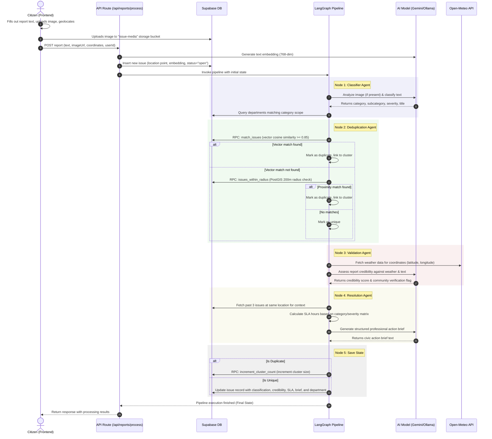

# CivicPulse

CivicPulse is an AI-powered civic issue reporting and management platform designed for Nashik, India. The platform enables citizens to submit reports about municipal issues, which are then processed, classified, validated, routed, and summarized by a multi-agent system built using LangGraph and Google's Gemini models.

---

## Technical Stack

### Core Framework
* **Next.js**: Version 16.2.9 (App Router, Turbopack, TypeScript, standalone output configuration for Docker).
* **React**: Version 19.2.4.
* **Package Manager**: `bun`.

### Frontend & Styling
* **Tailwind CSS**: Version 4.0.0.
* **Component Library**: shadcn/ui (Radix UI primitives).
* **Icons**: Lucide React and Hugeicons.
* **Animations**: Framer Motion and `tw-animate-css`.
* **Maps**: Mapbox GL JS (for client-side heatmap and map rendering).

### Database & Backend
* **Supabase**: Relational Postgres database.
* **PostGIS**: Spatial database extension for geographic coordinates and proximity queries.
* **pgvector**: Vector similarity extension for storing and searching semantic report embeddings.
* **Row-Level Security (RLS)**: Enforces access control rules at the database level.
* **Realtime**: Supabase Realtime listeners for live updates on the dashboard.

### Artificial Intelligence & Orchestration
* **LangGraph**: `@langchain/langgraph` + `@langchain/core` for stateful multi-agent workflow orchestration.
* **Unified AI Client**: Custom interface (`lib/ai/client.ts`) supporting:
  * **Google Generative AI (Default)**: Gemini 2.5 Flash, Gemini 2.5 Pro, and `gemini-embedding-001`.
  * **Ollama (Optional)**: OpenAI-compatible API connector supporting local or cloud models (e.g., `qwen3:30b-a3b` for Flash tasks, `qwen3:235b-a22b` for Pro tasks, and `nomic-embed-text` for embeddings).
* **Open-Meteo API**: Integrated into the validation agent to cross-reference weather conditions with reports.

---

## Directory Structure

```text
├── app/
│   ├── api/
│   │   ├── reports/
│   │   │   └── process/        # Main API route for report ingestion and pipeline execution
│   │   └── test/               # Health check endpoint for environment variables
│   ├── auth/
│   │   ├── callback/           # Handles OAuth/magic link session exchange
│   │   └── login/              # Login page (Google OAuth & email OTP)
│   ├── dashboard/              # Server Component rendering the citizen dashboard
│   ├── report/                 # Form wizard page for citizen report submission
│   ├── globals.css             # Root Tailwind CSS file
│   ├── layout.tsx              # Application layout container
│   └── page.tsx                # Landing/home page
├── components/
│   ├── dashboard/
│   │   └── DashboardClient.tsx # Client Component handling realtime Supabase subscriptions
│   └── ui/                     # Shared UI components (buttons, cards, badges, etc.)
├── lib/
│   ├── agents/                 # LangGraph pipeline nodes and graph definition
│   │   ├── agent1-classifier.ts
│   │   ├── agent2-deduplication.ts
│   │   ├── agent3-validation.ts
│   │   ├── agent4-resolution.ts
│   │   └── pipeline.ts
│   ├── ai/
│   │   └── client.ts           # Unified AI wrapper (Gemini and Ollama)
│   ├── auth/
│   │   └── actions.ts          # Server Actions for auth (Google, OTP, signOut)
│   ├── db/
│   │   ├── client.ts           # Browser-safe Supabase client
│   │   ├── server.ts           # Server-side cookie and service-role clients
│   │   └── types.ts            # TypeScript interfaces for database models
│   └── utils.ts                # Tailwind merge utilities
├── supabase/
│   └── migrations/             # SQL migrations containing table definitions and triggers
├── proxy.ts                    # Auth guard protecting /dashboard, /report, and /admin
├── package.json                # Project dependencies and npm scripts
└── Dockerfile                  # Docker build configuration targeting Cloud Run
```

---

## Step-by-Step Report Lifecycle and Backend Processing

When a citizen submits a civic issue report, the system processes it through a sequential, stateful pipeline. Below is the exact sequence of operations:



### 1. Citizen Form Submission
* The citizen accesses the `/report` route, provides a textual description of the issue, and optionally attaches an image.
* The browser's Geolocation API captures the latitude and longitude, which are resolved into a readable mailing address using the Google Maps Geocoding API.
* The frontend uploads the selected photo directly to the Supabase Storage bucket named `issue-media` using a client-side Supabase client.
* The form payload is sent to the `/api/reports/process` route.

### 2. Database Ingestion
* The API handler generates a 768-dimensional semantic embedding of the raw description text.
* A new row is inserted into the `issues` table using a service-role client. The coordinate pair is saved as a PostGIS geometry point: `POINT(lng lat)`. The status is initialized to `'open'`.

### 3. Agent 1: Classifier (`agent1-classifier.ts`)
* If an image was uploaded, the system calls `analyzeImage` with the Gemini Flash vision capability to describe the visible problem, hazards, and severity.
* The text description and the image analysis are sent to the AI model to generate a structured classification JSON object.
* This returns the primary category (`infrastructure`, `sanitation`, `safety`, `utility`, `environment`), a specific subcategory, a severity rating (1–10), emergency status, and a suggested title.
* The agent queries the `departments` table in Supabase and maps the issue to a department whose `category_scope` matches the determined category.

### 4. Agent 2: Deduplication (`agent2-deduplication.ts`)
* To avoid redundant workflow processing, the system checks for existing reports detailing the same problem.
* **Step A (Semantic Similarity)**: The system executes the Supabase RPC function `match_issues` using the report's embedding. It searches for records with a cosine similarity score of `0.85` or higher.
* **Step B (Spatial Proximity)**: If no semantic match is found, the agent falls back to a spatial query. It executes the Supabase RPC function `issues_within_radius` to search for reports in the same category within a `200-meter` radius.
* **Outcome**: If a duplicate is identified, the report is assigned the existing issue's `cluster_id` and the pipeline marks it as a duplicate, bypassing subsequent validation and resolution steps.

### 5. Agent 3: Validation (`agent3-validation.ts`)
* The agent fetches current and historical weather data for the issue's coordinates using the Open-Meteo API.
* The AI model evaluates the report description and weather context to generate a credibility score (1–10) and determines whether the weather corroborates the claim (e.g., street flooding reported during heavy rainfall).
* If the credibility score is below `6`, the agent sets `needs_community_verification` to `true`, which flags the issue for citizen verification in the UI.

### 6. Agent 4: Resolution (`agent4-resolution.ts`)
* The agent queries the database for the last three issues reported at the exact same location to compile a historical context.
* It calculates the SLA deadline by adding calculated hours from an urgency matrix (`SLA_MAP`) based on the issue category and severity.
* The AI model drafts a structured, professional 150–200 word civic action brief outlining:
  * **ISSUE SUMMARY**
  * **LOCATION**
  * **EVIDENCE**
  * **URGENCY**
  * **HISTORICAL CONTEXT**
  * **RECOMMENDED ACTION**
  * **PRIORITY**

### 7. State Persistence (`saveToDatabase`)
* The final step executes the database updates:
  * If classified as a duplicate, the system calls the `increment_cluster_count` RPC to update the representative cluster's counter.
  * If classified as unique, the system updates the original issue row with the classification metadata, credibility score, SLA deadline, mapped department ID, and the drafted civic brief.

---

## Database Schema

The database is built on Supabase Postgres and uses the following tables:

* **`profiles`**: Stores user accounts. Extends `auth.users` via a Postgres trigger. Roles are categorized as `'citizen'` or `'admin'`. Keeps track of `karma_score` and push notification subscriptions.
* **`departments`**: Civic departments (e.g., Public Works, Sanitation) containing a `category_scope` array defining which categories they handle.
* **`issues`**: The core table. Contains description, category, severity, status, PostGIS `location` point, pgvector `embedding`, and fields generated by the AI agents (`civic_brief`, `sla_deadline`, `credibility_score`).
* **`issue_clusters`**: Groups duplicate issues together under a single representative issue.
* **`verifications`**: Ledger of community votes to verify the authenticity of low-credibility reports.
* **`karma_events`**: An audit log of karma point transactions awarded to citizens for reporting, verifying, or upvoting.
* **`upvotes`**: Records upvotes on issues, preventing duplicate votes via a composite unique index on `(issue_id, user_id)`.
* **`predictive_alerts`**: Scheduled hotspot predictions generated by Agent 5 (async batch pipeline).

---

## Getting Started

### Prerequisites
* [Bun](https://bun.sh/) runtime installed.
* A Supabase project with the schema initialized.
* API keys for Gemini, Google Maps Geocoding, and Mapbox.

### Installation
1. Clone the repository.
2. Install dependencies:
   ```bash
   bun install
   ```

### Configuration
Create a `.env.local` file in the root directory and configure the following variables:
```env
NEXT_PUBLIC_SUPABASE_URL=your-supabase-url
NEXT_PUBLIC_SUPABASE_ANON_KEY=your-anon-key
SUPABASE_SERVICE_ROLE_KEY=your-service-role-key
GEMINI_API_KEY=your-gemini-api-key
GOOGLE_MAPS_API_KEY=your-google-maps-api-key
NEXT_PUBLIC_GOOGLE_MAPS_API_KEY=your-google-maps-api-key
NEXT_PUBLIC_MAPBOX_TOKEN=your-mapbox-token
NEXT_PUBLIC_APP_URL=http://localhost:3000
```

### Local Development
Start the Next.js development server:
```bash
bun run dev
```
Open [http://localhost:3000](http://localhost:3000) to view the application.
